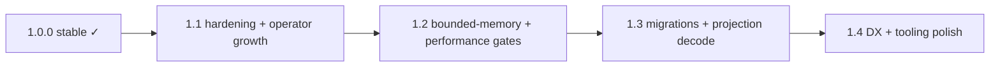

# Typra Roadmap

This document is the **project roadmap** for Typra: a typed, embedded, single-file database with Rust-first core and ergonomic Python bindings.

- **Current release**: `1.0.0` (see [`CHANGELOG.md`](CHANGELOG.md))
- **0.5.x patch notes**: `0.5.1` refactored the Rust `Database` implementation into `db/` submodules; the public API for 0.5.x was unchanged until **0.6.0**.
- **Next milestone**: `1.1.0` — planner/operator growth + query hardening. **`1.0.0`** is **delivered**; see [`CHANGELOG.md`](CHANGELOG.md).
- **Roadmap style**: release-based milestones (SemVer). Patch versions are bugfix-only; minor versions (`1.x`) may add features without breaking stable APIs.
- **1.x `.typra` compatibility**: any **1.y** release must read files written by **1.0+** (and supported pre-1.0 minors); breaking on-disk changes require **2.0** / `FORMAT_MAJOR` bump. Policy: [`docs/reference/compatibility.md`](docs/reference/compatibility.md), [`docs/specs/format_evolution.md`](docs/specs/format_evolution.md); CI: `make test-format-compat`.

## Guiding principles (from the specs)

Typra is designed around:

- **Schema-first** collections of validated records
- **Validation on write** (type + constraints + indexes)
- **Nested objects and typed lists** as first-class
- **Single-file, zero-config deployment**
- **Safe schema evolution** over time

In addition, Typra should support **multiple storage/compute modes** (embedded single-file ergonomics):

- **In-memory mode**: fast operations without implicit durability; supports **explicit snapshot export/import** (save/load).
- **On-disk mode**: durable single-file operation (the default embedded deployment story).
- **Future hybrid + streaming mode**: keep a normal file-backed database, but use a **buffer pool** plus **streaming/bounded-memory operators** so queries (notably joins and groupby/aggregations) can run when data exceeds RAM.

Quick links:
- **Mode semantics & architecture**: see [In-memory, hybrid, and streaming execution (refined plan)](#in-memory-hybrid-and-streaming-execution-refined-plan)
- **Release milestones**: see [Roadmap by release](#roadmap-by-release)
- **User migration**: see [`docs/guides/python.md`](docs/guides/python.md) (schema migrations section) and [`docs/reference/cli.md`](docs/reference/cli.md).
- **Queries & indexes (Python)**: [`docs/guides/python.md`](docs/guides/python.md) (including [realistic on-disk workflow](docs/guides/python.md#realistic-workflow-indexed-queries-on-disk))

Primary design references:
- [`docs/01_full_architecture_spec.md`](docs/01_full_architecture_spec.md)
- [`docs/02_on_disk_file_format.md`](docs/02_on_disk_file_format.md)
- [`docs/04_schema_dsl_spec.md`](docs/04_schema_dsl_spec.md)
- [`docs/05_query_planner_and_execution_spec.md`](docs/05_query_planner_and_execution_spec.md)
- [`docs/06_record_encoding_v1.md`](docs/06_record_encoding_v1.md) (record payload v1, 0.5.0+)
- [`docs/07_record_encoding_v2.md`](docs/07_record_encoding_v2.md) (record payload v2, 0.6.0+)
- [`docs/guides/why_typra.md`](docs/guides/why_typra.md) (positioning) · [`docs/comparisons/`](docs/comparisons/index.md) (vs other embedded stores)
- [`docs/guides/python.md`](docs/guides/python.md) (Python API: registration, **indexes**, **queries**, subset rows)
- [`docs/guides/pydantic.md`](docs/guides/pydantic.md) · [`docs/guides/fastapi.md`](docs/guides/fastapi.md) · [`examples/`](examples/README.md) (runnable samples)
- [`docs/typed_embedded_db_spec.md`](docs/typed_embedded_db_spec.md)

## Near-term focus

**`0.6.0`** (validation, `RowValue`, record v2, catalog constraints), **`0.7.0`** (secondary indexes, minimal queries, subset projection), **`0.8.0`** (transactions, format minor 6, recovery), **`0.9.0`** (schema evolution tooling, compaction prototype, richer queries and record ops), **`0.10.0`** (DB-API 2.0 + read-only query text), **`0.11.0`** (pager/buffer pool + checkpoints), and **`0.12.0`** (bounded-memory scaffolding + external sort v0) are **delivered**. **`1.0.0`** sections below call out **what is already partially done** vs **what remains** so planning matches the repo’s actual baseline.

**Post-1.0 focus (1.x):** engine hardening, bounded-memory operators, schema/migration ergonomics, and Python DX — while preserving the 1.x format-compat contract.

## Status snapshot (current: 1.0.x)

**Implemented today:**
- **Rust**: `Database::open` / **`open_with_options`** (on-disk and in-memory via `VecStore`); persisted **schema catalog** with **`register_collection` / `register_schema_version`**, schema compatibility classification + migration planning helpers, **multi-segment field paths**, **record payload v3**; **`insert` / `get` / `delete`** with **validation**; **secondary indexes** and typed **queries**; **transactions**, **checkpoints**, **compaction**; **`typra-cli`** operational tooling; **`fuzz/`** harness; format minor **6** with legacy segment replay compatibility (see [`CHANGELOG.md`](CHANGELOG.md)).
- **Rust workspace policy**: root [`Cargo.toml`](Cargo.toml) sets **`unsafe_code = forbid`** via **`[workspace.lints.rust]`** (no `unsafe` in workspace crates).
- **Python**: primary **`typra.models`** API plus **`fields_json`**; full **`Database`** surface including migrations, compaction, snapshots; **`typra.dbapi`** (PEP 249 read-only `SELECT` subset). See [`python/typra/README.md`](python/typra/README.md) and [`docs/reference/python_api.md`](docs/reference/python_api.md).
- **CI / coverage**: multi-OS Rust and Python CI; **`cargo llvm-cov`** with a **minimum line-coverage gate for `typra-core`** (see [`Makefile`](Makefile) `COVERAGE_TYPRA_CORE_LINES`); **`make check-full`** includes **`scripts/verify-doc-examples.sh`**.

**Earlier releases** (details in [`CHANGELOG.md`](CHANGELOG.md)):
- **`0.8.0`**: **TxnBegin** / **TxnCommit** / **TxnAbort** segments, format minor **6**, **`Database::transaction`** + staged read-your-writes, **`OpenOptions` / `RecoveryMode`**, **`Store::truncate`**, Python **`with db.transaction():`**; autocommit **insert** / **register** use single txn batch + one **sync**.
- **`0.7.0`**: Secondary **indexes** (unique + non-unique), persisted **`SegmentType::Index`** payloads, minimal **query** planner (`Predicate::Eq` / `And`), **`limit`**, heuristic **`explain`**, **`Database::query_iter`**, **`row_subset_by_field_defs`** / nested merge projections; Python **`indexes_json`**, **`collection(...).where` / `and_where` / `limit` / `explain` / `all`**, **`all(fields=[...])`**; Criterion **`make bench`** query microbench.
- **`0.6.0`**: **Validation** engine, **`RowValue`**, record payload **v2**, catalog **v3** constraints, **`DbError::Validation`**.
- **`0.5.1`**: Internal `Database` split into `db/` submodules; removed unused **`StorageEngine`** placeholder; public API unchanged.
- **`0.5.0`**: Record payload v1, **primary_field** on catalog create, **`insert` / `get`**, **`VecStore`** / snapshots, format minor **5** (see [`docs/06_record_encoding_v1.md`](docs/06_record_encoding_v1.md)).
- **`0.4.0`**: Persisted **schema catalog** in **Schema** segments, **`register_collection` / `register_schema_version`**, format minor **4** (lazy **0.3 → 0.4** on first catalog write).
- **`0.3.0`**: Superblock A/B, append-only segments, manifest publication, safe **0.2 → 0.3** upgrade for header-only `0.2` files.
- **`0.2.0`**: File header + format recognition, schema metadata scaffolding, `Store` / `FileStore`, runnable `open` example, Python `__version__`.

## Roadmap by release

Each milestone lists:
- **Rust (core + public API)**: what lands in `typra-core` / `typra` / `typra-derive`
- **Python**: what lands in `python/typra` (bindings and (later) pure-Python helpers)
- **Definition of done**: tests, docs, and behavioral guarantees

### 0.2.0 — On-disk foundation (header + format recognition) and schema metadata types

**Goal**: move from “file exists” to “file has a recognized format,” plus internal types to represent schemas.

- **Rust**
  - Define the **file header** (magic/version/feature flags) and validate it on open.
  - Introduce core schema metadata structures (collection IDs, field paths/types, version IDs).
  - Expand error taxonomy beyond `Io` / `NotImplemented` as needed for format/schema issues.
  - Introduce an internal storage abstraction boundary (e.g. a “backing store” interface) so future **in-memory vs on-disk** can share the same logical engine code.
- **Python**
  - Keep surface area small; ensure packaging/release remains stable.
  - Add docstring/module docs clarifying current maturity and planned APIs.
- **Definition of done**
  - New/old file open behaviors are tested (new file creation writes header; existing file validates header).
  - Format versioning strategy documented (what changes imply major/minor bump).
  - Crash-safety story for the header/superblock approach is explicitly stated (even if not fully implemented yet).

**Shipped in 0.2.0 (implemented):**
- **File header + format recognition** (new file writes header; existing file validates; truncated/non-typra errors).
- **Error taxonomy**: `DbError::Format` / `DbError::Schema`.
- **Schema metadata scaffolding**: `CollectionSchema`, `FieldPath`, `Type`, etc.
- **Internal storage boundary**: `Store` + `FileStore` used by `Database::open`.
- **Tests** covering header creation/validation/corruption, decode errors, and schema path edge cases.
- **Docs**: `ROADMAP.md` + user guides under `docs/`.
- **CI / coverage**: multi-OS Rust+Python CI plus coverage artifacts (today the repo also enforces a **minimum `typra-core` line coverage** in CI—see [`Makefile`](Makefile); that gate did not exist at the 0.2.0 ship date).

**Deferred from 0.2.x scope (still planned):**
- “Minimal manifest / superblocks / checkpoints” durability machinery (lands with later storage milestones).

Design anchor: [`docs/02_on_disk_file_format.md`](docs/02_on_disk_file_format.md)

### 0.3.0 — Append-only segment writer/reader + minimal recovery checks

**Goal**: have a real “append-only segment” primitive for writing structured events to the database file.

- **Rust**
  - Implement **segment headers** and segment types (at minimum: schema + record + manifest/checkpoint).
  - Implement a minimal **segment writer/reader** with checksums.
  - Add a “scan segments” debug utility (internal API) to support testing and future tooling.
  - Start a minimal “manifest/checkpoint pointer” mechanism (even if simplistic at first).
  - Define the first **snapshot export/import** interfaces (API only if needed; implementation can land once record encoding exists).
- **Python**
  - No major new public API required; optionally expose a `typra.debug_*` module for introspection (if desired).
- **Definition of done**
  - Roundtrip tests for writing/reading segments.
  - Corruption detection tests (bad checksum/bad magic yields deterministic error).
  - Backwards compatibility behavior documented for `0.2.x` files.
  - Decoder hardening: malformed segments/headers never panic (and are fuzz-tested once the surface exists).

**Shipped in 0.3.0 (implemented):**
- **Format + open behavior**
  - On-disk format minor bumped to **0.3** to reserve superblock space and enable segment framing.
  - Safe **0.2 → 0.3** upgrade path for **header-only** `0.2` files; `0.2` files with extra bytes are rejected to avoid corrupting unknown layouts.
- **Superblocks (scaffolding)**
  - Reserve **Superblock A/B** (4 KiB each) after the file header.
  - Select the newest valid generation on open; tolerate one corrupt superblock as long as the other is valid.
- **Segments (scaffolding)**
  - Add a minimal checksummed segment header + segment writer/reader and an internal `scan_segments` utility.
- **Tests**
  - Added roundtrip/corruption/upgrade/reopen selection tests and “nasty bytes” decoder hardening tests.
- **Docs**
  - Updated guides/READMEs/contributing notes to reflect superblocks + checksummed segments and the compatibility story.

**Remaining for 0.3.0 (to finish the milestone):**
- (none)

Design anchor: segment model + checksums in [`docs/02_on_disk_file_format.md`](docs/02_on_disk_file_format.md)

### 0.4.0 — Persisted schema catalog + collection registration

**Goal**: persist schema definitions in the file and support registering collections.

**Shipped in 0.4.0 (implemented):**

- **Rust**
  - Persisted **schema catalog** records in **`SegmentType::Schema`** payloads (v1 binary encoding: create collection + new schema version).
  - **`Database::register_collection`** / **`Database::register_schema_version`**; **`Catalog`** replay on open; stable **`CollectionId`** / **`SchemaVersion(1)`** baseline; lazy **0.3 → 0.4** header bump on first catalog write.
- **Python**
  - **`typra.Database`**: **`open`**, **`register_collection(name, fields_json)`** (no primary-field argument yet), **`collection_names()`**; **`fields_json`** documented in [`python/typra/README.md`](python/typra/README.md).

**Superseded by 0.5.0** (breaking): **`register_collection(..., primary_field)`**, **`insert`**, **`get`**, in-memory and snapshot constructors—see [CHANGELOG](CHANGELOG.md).

- **Tests / docs**
  - Integration tests for duplicate names, unknown id, reopen, corrupt payload, lazy header bump; user guide note in models/collections doc.

**Deferred / later**

- Pydantic-based model inference (still an open question; explicit JSON remains the v1 Python story).
- **Delivered in 0.5.0:** `VecStore` / `Database::open_in_memory`, snapshot import/export, record insert/get (see [CHANGELOG](CHANGELOG.md)).

- **Definition of done**
  - Registering a collection persists the catalog entry and survives reopen.
  - Duplicate name handling and versioning behavior specified and tested.

Design anchor: catalog requirements in [`docs/01_full_architecture_spec.md`](docs/01_full_architecture_spec.md)

### 0.5.0 — Record encoding v1 + insert/get by primary key

**Status:** **Delivered** in v0.5.0 (encoding in [`docs/06_record_encoding_v1.md`](docs/06_record_encoding_v1.md)).

**Goal**: store records and retrieve them; establish the first durable record encoding.

**What shipped in v0.5.0**
- **Rust**: `Database<S: Store>` with **`FileStore`** and **`VecStore`**; **`insert` / `get`** by **`CollectionId`** and primary-key **`ScalarValue`**; record payload **v1** (insert op; replace/delete op codes reserved); **latest row** map rebuilt on open (last segment wins); **catalog wire v2** with **`primary_field`** on create; **`Catalog::lookup_name`**; **`snapshot_bytes`**, **`from_snapshot_bytes`**, **`into_snapshot_bytes`**; lazy header **4 → 5** on first record write.
- **Python**: **`register_collection(..., primary_field)`**, **`insert(collection_name, row)`**, **`get(collection_name, pk)`**, **`open_in_memory`**, **`open_snapshot_bytes`**, **`snapshot_bytes`**; rows as **`dict`** / scalar PKs (no ORM-style `db.users` accessor yet).

**Still open / later** (was aspirational in the milestone text): typed **`Collection<T>`** handles, **replace/delete** record ops, rich **Pydantic**-first return types, and **attribute** accessors on **`Database`**.

- **Rust** *(original milestone bullets; see “What shipped” vs “Still open”)*
  - Implement record event encoding/decoding (insert/replace/delete; starting with insert + get).
  - Add `Collection<T>` typed handle and `insert` + `get(pk)` APIs (exact shape may evolve).
  - Implement primary-key indexing mechanism sufficient for `get(pk)` (may be an embedded index or minimal index segment).
  - Establish record visibility rules for “latest version” (even before full MVCC).
  - Implement **in-memory database** mode with the same logical APIs:
    - fast insert/get
    - no durability guarantees
    - **explicit snapshot export/import** to/from the on-disk format (initially as a whole-db snapshot)
- **Python** *(original milestone bullets)*
  - Expose `db.collection("User")` / `db.users` + `insert` + `get` for the first supported model type.
  - Return validated model instances (or dicts) in a predictable way; document trade-offs.
  - Add Python surface for in-memory usage (e.g. `Database.in_memory()` or `Database(":memory:")`) plus snapshot save/load entrypoints.
- **Definition of done**
  - Records written survive process restart and reopen (durability validated via tests).
  - Schema mismatch errors are crisp (wrong schema version cannot decode silently).
  - Encoding documented (at least at the conceptual level and stability guarantees).
  - In-memory insert/get and snapshot export/import are covered by integration tests (Rust and Python).

Design anchor: record log + encoding strategy in [`docs/02_on_disk_file_format.md`](docs/02_on_disk_file_format.md) and payload details in [`docs/06_record_encoding_v1.md`](docs/06_record_encoding_v1.md)

### 0.6.0 — Validation engine (types + constraints) and better errors

**Status:** **Delivered** in v0.6.0 (see [`CHANGELOG.md`](CHANGELOG.md) and [`docs/07_record_encoding_v2.md`](docs/07_record_encoding_v2.md)).

**Goal**: enforce schema contracts at write time with high-quality error reporting.

- **Rust** *(shipped)*
  - Type validation for primitives/composites (`Optional` / `List` / `Object` / `Enum`), strict unknown fields for objects, **`RowValue`** + **record payload v2**, **`DbError::Validation`**, catalog **v3** constraints on **`FieldDef`**.
  - Constraint validators: numeric min/max, string/list length, regex, email/url shape, nonempty.
  - Validation runs before segment append.
- **Python** *(shipped)*
  - Engine validation is authoritative; nested **`dict`** / **`list`** / **`None`** for optionals; optional **`constraints`** in **`fields_json`**; **`ValueError`** for validation failures.
- **Definition of done** *(met for core scope)*
  - Deterministic validation semantics across Rust/Python for supported types.
  - Errors include nested **paths** via **`ValidationError`**.

Design anchor: validation semantics in [`docs/typed_embedded_db_spec.md`](docs/typed_embedded_db_spec.md)

### 0.7.0 — Secondary indexes (unique + non-unique) and simple filters

**Status:** **Delivered** in v0.7.0 (see [`CHANGELOG.md`](CHANGELOG.md)).

**Goal**: make practical lookups beyond primary key: equality filters backed by indexes, small conjunctive queries, and row projections.

**What shipped in v0.7.0**

- **Rust (`typra-core`)**
  - **`IndexDef`** on create / new schema version; catalog wire **v4** carries **`indexes`**; replay builds **`IndexState`** from **`SegmentType::Index`** segments.
  - **Insert-time** index maintenance (append index segment batch with each insert); **unique** enforcement across primary keys.
  - **`Query`** / **`Predicate`** (`Eq`, `And`), **`plan_query`**, **`execute_query`** / **`execute_query_iter`**, **`Database::query_iter`**; **`limit`**; string **`explain`** (heuristic: index lookup vs scan + residual).
  - **`row_subset_by_field_defs`** (nested path merge for projected dicts) used for subset materialization; tests for index replay, planner residual, subset consistency.
  - **Criterion** bench [`crates/typra-core/benches/query.rs`](crates/typra-core/benches/query.rs) and **`make bench`** (`get` vs indexed equality vs scan).
- **Python (`typra`)**
  - Optional **`indexes_json`** on **`register_collection`**; **`db.collection(name)`** with **`where`**, **`and_where`**, **`limit`**, **`explain`**, **`all()`**, **`all(fields=[...])`** (catalog-validated path allowlist).
  - Docs: **[`docs/guides/python.md`](docs/guides/python.md)** (queries, indexes, DB-API design note); verified examples in **`scripts/verify-doc-examples.sh`**; integration tests under **`python/typra/tests/`**.

**Deferred / later** (historical 0.7 notes — superseded where **1.0** shipped)

- **Index maintenance**: **update**/logical **delete** shipped in **0.9.0**; indexes reflect insert/replace/delete.
- **Schema paths**: **multi-segment** `FieldDef.path` + record **v3** shipped in **1.0.0** (see [`docs/specs/record_encoding_v3.md`](docs/specs/record_encoding_v3.md)).
- **Typed subset models**: Rust `collection::<T>()` + Python `typra.models.collection` compatibility checks shipped in **1.0.x**; projection-aware decode remains **1.1**.
- **Operators**: join/agg spill foundations in **0.12–0.13**; broader planner growth is **1.1+**.

Design anchor: query planner + AST in [`docs/05_query_planner_and_execution_spec.md`](docs/05_query_planner_and_execution_spec.md)

### 0.8.0 — Transactions v1 (single-writer) + crash-safe durability

**Status:** **Delivered** in **0.8.0** (see [`CHANGELOG.md`](CHANGELOG.md)). This phase assumes **0.7.0** is on disk: **Schema** / **Record** / **Index** segments, **MANIFEST** + **superblock** publication, **catalog v4** (constraints + index defs), **last-write-wins** replay, **minimal queries** + **`query_iter`**, and **insert-only** index maintenance.

**Goal:** **Atomic multi-write batches** and a **defined recovery story** after crash or partial write—beyond today’s “append segments in order and replay all.”

**Already in place (0.2–0.7 — do not re-implement as 0.8 deliverables)**  
Append-only segments + checksums, dual superblocks, manifest pointer, schema + record + **index** replay, **`insert` / `get`**, **validation**, **secondary indexes** + **unique** enforcement on insert, **Python** `indexes_json` + **query builder**, **Criterion** query microbench.

**Rust — implemented in 0.8.0**
- **Transaction framing in the log**: `TxnBegin` / `TxnCommit` / `TxnAbort` segment markers so multiple record/index/catalog appends form **one atomic unit** at replay.
- **Single-writer policy** (process-local): `Database::transaction` enforces non-nested transactions; Python bindings serialize via the database mutex.
- **Recovery**: on open, detect **torn** tails or **incomplete** transaction tails; default is **auto-truncate** to last committed prefix, with `Strict` mode that refuses open and returns a clear error.
- **Index + record atomicity**: autocommit insert writes index+record in one committed batch (no orphaned index keys after crash for format minor 6 writes).

**Still future work (not required for 0.8.0 v1)**
- **Checkpoints / generations**: the manifest + superblock publication is still minimal (not a full checkpoint / compaction story).

**Explicit deferrals (not gating 0.8.0 v1)**  
- **Buffer pool / pager** and **hybrid buffered reads**: groundwork for large files and **bounded-memory operators**—target **0.8.x / 0.9+** unless a tiny read cache is strictly required for txn IO (see [In-memory, hybrid, and streaming execution](#in-memory-hybrid-and-streaming-execution-refined-plan)).
- **Async storage path**: keep interfaces **compatible** with future async; **no** requirement to ship `tokio`/runtime integration in 0.8.0.

**Python — implemented in 0.8.0**
- **`with db.transaction(): ...`** maps to Rust txn boundaries; **exception → rollback** (no durable commit).

**Deferred / optional follow-ups (0.8.x+)**
- **DB-API 2.0 (PEP 249)**: shipped as an experimental, read-only opt-in module (`typra.dbapi`) in **0.10.0** (minimal `SELECT` subset).

**Definition of done** *(met for 0.8.0 scope)*
- **Crash / partial-write tests**: deterministic recovery behavior for incomplete transaction tails (auto-truncate) and deterministic failure in strict mode.
- **Docs**: transaction semantics, durability guarantees vs 0.7, concurrency model, interaction with **indexes** and **queries**.

Design anchor: superblocks + commit markers in [`docs/02_on_disk_file_format.md`](docs/02_on_disk_file_format.md)

### 0.9.0 — Schema evolution & migrations (safe changes), plus compaction prototype

**Status:** **Delivered** (see [`CHANGELOG.md`](CHANGELOG.md)).

**What shipped in 0.9.0**

- **Schema compatibility rules**: schema diffs are classified as **safe**, **needs migration**, or **breaking**, and enforced on schema-version registration (with an explicit escape hatch for “force”).
- **Migration tooling**: a **plan** API plus minimal helpers (backfill and index rebuild) to support safe upgrades.
- **Record ops**: **replace/delete** semantics with consistent **secondary index** maintenance (index deltas).
- **Query expansion**: `OR`, **range predicates**, and `order_by` (in-memory sorting initially).
- **Compaction prototype**: whole-file rewrite (`compact_to`, `compact_in_place`) with correctness tests for rows + indexes.

**Still future work (post-0.9)**
- More complete migration execution primitives (beyond backfill/rebuild), richer index planning for ranges, and bounded-memory operators (external sort/spill) once pager/streaming groundwork is scheduled.

Design anchor: evolution rules in [`docs/01_full_architecture_spec.md`](docs/01_full_architecture_spec.md)

### 0.10.0 — DB-API 2.0 + minimal query text (read-only)

**Goal:** make Typra usable via standard Python DB tooling while keeping the engine’s typed query AST as the source of truth.

- **Rust**
  - Introduce a **text-to-Query adapter** (internal module) that parses a small read-only `SELECT`-style subset into the existing `typra-core` query AST.
  - Define a stable mapping from the supported text grammar → `Query` / `Predicate`:
    - `SELECT <cols|*> FROM <collection>`
    - `WHERE` with `=` / `AND` / `OR` and range predicates (`< <= > >=`)
    - `ORDER BY <field> [ASC|DESC]`
    - `LIMIT n`
  - Enforce schema/path validation as today (fail fast with clear errors).
- **Python**
  - Add `typra.dbapi` implementing **PEP 249** for the supported read-only subset:
    - `connect(path)` (maps to `Database.open`)
    - `cursor.execute(text, params)` (parameter binding for the supported subset)
    - `fetchone` / `fetchmany` / `fetchall` and predictable `cursor.description`
    - transactions via `commit` / `rollback` mapped to `Database::transaction` boundaries (single-writer semantics)
  - Decide result row shape: tuples by default, with an opt-in dict row factory.
- **Definition of done**
  - Cross-platform CI tests for DB-API + query-text subset.
  - Docs: supported grammar, parameter rules, and limitations.

### 0.11.0 — Pager/buffer pool + checkpoints (durability + performance)

**Status:** **Delivered** in **0.11.0**.

**Goal:** shift from “replay everything” toward bounded replay time and a foundation for streaming execution.

**Shipped in 0.11.0 (implemented):**
- **Rust**
  - **Pager/buffer pool boundary** for on-disk reads (page-sized cache) in `FileStore`.
  - **Checkpoint** segment payload (logical state snapshot) and superblock pointers to the latest checkpoint.
  - **Open path** loads checkpoint state and **replays only the tail** after `replay_from_offset`.
  - Recovery behavior: **Strict** rejects corrupt checkpoints; **AutoTruncate** falls back to full replay.
- **Python**
  - No new required surface (Rust engine change is transparent). Operational hooks may be added later.

**Definition of done (met):**
- Recovery/corruption tests covering checkpoints.
- Workspace builds/tests pass (`cargo test`).

### 0.12.0 — Bounded-memory operators (spill/external algorithms)

**Status:** **Delivered** in **0.12.0** (v0 bounded-memory scaffolding).

**Goal:** enable queries and DB-API reads to operate when datasets exceed memory (incrementally; start with external algorithms + streaming boundaries).

**Shipped in 0.12.0 (implemented):**
- **Rust**
  - **Ephemeral `Temp` segments** for scratch spill data; recovery + replay ignore them.
  - **Spill helper (v0)**: RAII truncation/cleanup of temp spill bytes (`TempSpillFile` / `TempSpillGuard`).
  - **Operator boundary (v0)**: internal pull-based key pipeline (`RowSource`) used by `query_iter` to avoid eager materialization.
  - **External sort (v0)**: `order_by` can spill to `Temp` segments for large inputs (file-backed DBs).
- **Python**
  - **DB-API cursor incremental fetch (v0)**: `fetchone` / `fetchmany` / `fetchall` refill results incrementally instead of materializing all rows on `execute`.

**Definition of done (met for v0):**
- Workspace checks pass (`make check-full`), including doc example verification.
- Tests cover: temp segments ignored on reopen, and external sort correctness on large inputs.

**Delivered after 0.12.0 (implemented in `main`):**
- Spillable aggregation v0 (group-by `int64` with `COUNT` + `SUM(int64)`), with forced-spill tests.
- Join foundation v0 (spill-capable equi-join **match-count** on `int64`), with forced-spill tests.

### 0.13.0 — Hardening + compatibility matrix + pre-1.0 cleanup

**Goal:** make the 1.0.0 jump mostly policy/guarantees rather than risky refactors.

**Status:** **Delivered** in **0.13.0**.

**Shipped toward 0.13.0 (implemented in `main`):**
- **Rust**
  - `cargo-fuzz` harness under `fuzz/` with fuzz targets for header/superblock/segment decode and payload decoders.
  - Property tests (initial `proptest` invariants) for snapshot roundtrips.
  - Join/aggregation spill foundations with correctness tests under forced spilling.
- **Docs**
  - Compatibility matrix: [`docs/reference/compatibility.md`](docs/reference/compatibility.md).

- **Rust**
  - Add dedicated **fuzz** targets (header/segments/catalog/record/index payloads).
  - Add **property tests** (index invariants, replay idempotence, txn + checkpoint interactions).
  - Publish a **compatibility matrix** (read/write policy per file-format minor; API policy per crate).
  - Continue bounded-memory operators: **spillable aggregation** + stricter memory-budgeted execution tests.
- **Python**
  - Finalize typing story for DB-API rows and `typra.pyi` stability guarantees.
- **Definition of done**
  - `make check-full` remains green across platforms.
  - Docs consolidated: Getting Started, Queries, Transactions, Operations, DB-API + query-text subset.

### 1.0.0 — Stable public API + format guarantees

**Status:** **Delivered** (see [`CHANGELOG.md`](CHANGELOG.md) **1.0.0**). Next work targets **1.1.0**.

**Goal:** “Safe to ship in production apps”: semver + **file-format compatibility policy**, security posture, and **operational** docs.

**Delivered in 1.0.0**
- **`make check-full`**, **`verify-doc-examples`**, **`typra-core` line-coverage gate**, operational **`typra-cli`**, **`typra.models`**, multi-segment schema paths + record v3, compatibility/readiness docs.

#### 1.0 “must-have” (delivered)

These items were high-leverage for real applications shipping Typra as an embedded DB. **All listed below shipped in 1.0.0** unless noted as deferred to 1.1.0.

- **Operational CLI (`typra` binary)**:
  - `typra inspect <path>`: print header/minor, superblock generations, latest checkpoint offset, catalog summary (collections, schema versions, indexes).
  - `typra verify <path>`: run a read-only integrity scan (checksums, segment framing, catalog decode) with a clear exit code.
  - `typra dump-catalog <path> --json`: machine-readable catalog output for debugging/support.
  - Definition of done: cross-platform (macOS/Linux/Windows) smoke tests; docs page with examples.

- **Cross-process safety (file locking policy)**:
  - Prevent two writers from corrupting the same `.typra` file; document the concurrency contract.
  - Prefer “single writer / many readers” where feasible; define behavior for Windows vs Unix locking.
  - Definition of done: integration tests demonstrating a second writer fails fast with a crisp error.

- **Backup/restore primitives**:
  - Provide a supported way to create a consistent copy of an on-disk database (e.g. `Database::checkpoint()` + “copy bytes” guidance, or an explicit `export_snapshot_to_path` API).
  - Python parity: `db.export_snapshot(path)` / `Database.open_snapshot(path)` (names TBD).
  - Definition of done: docs and tests for “backup while reads are happening” (single-writer contract).

- **Schema path support (multi-segment field paths)**
  - Make nested object fields addressable by multi-segment `FieldPath` for schema declarations where practical (or explicitly document the limitation as a 1.0 constraint).
  - Definition of done: register schema with nested paths, enforce validation and projections, and support secondary indexes on nested scalar paths (when type is indexable).

- **Typed, model-first Python API stabilization**
  - Treat `typra.models` as the primary interface (dataclass + Pydantic v2), including constraints/indexes declarations, schema evolution (`plan/apply`), and patch updates.
  - Lock a public “v1” contract for `typra.models` (errors, naming rules, supported typing constructs).
  - Definition of done: parity tests for dataclass and Pydantic; docs are class-model-first; `typra.pyi` stable for the `models` surface.

- **Observability / debug-ability**
  - Add structured error codes (or stable error “kinds”) so apps can reliably distinguish validation vs IO vs format corruption vs schema mismatch.
  - Add optional tracing hooks (Rust `tracing` feature-gated) for open/replay/checkpoint/compaction and query planning.
  - Definition of done: docs on enabling tracing; tests ensure the feature flag compiles in workspace.

- **Performance + regression gates**
  - Expand Criterion benches to cover: transactions, compaction, checkpointed open, and a representative indexed query.
  - Add at least one “budget” guardrail in CI (e.g. compare against a recorded baseline in a non-blocking job, or run benches on demand with saved results).
  - Definition of done: documented performance methodology and a repeatable bench command set.

**Delivered in 1.0.0 (policy + operations + models)**

- **Operational CLI**, **file locking**, **backup/restore**, **multi-segment paths + record v3**, **`typra.models`** stabilization, **tracing** feature, **compatibility/security/readiness docs**, and **CI gates** — see [`CHANGELOG.md`](CHANGELOG.md) **1.0.0** and [`docs/reference/readiness.md`](docs/reference/readiness.md).

**Deferred to 1.1+**:

- Projection-aware decode, ORDER BY spill isolation, expanded join/agg operators, **`DbModel` derive** nested paths/constraints, optional **`cargo-deny`**, expanded property tests beyond `property_invariants.rs`, Python async.

**Definition of done** *(met for 1.0.0)*
- End-to-end **documented** journey: register → insert → **index/query** → **txn batch** → reopen → **migrate** → **compact** → recover from controlled corruption tests.
- Doc set: Getting Started, Schema, Queries, Transactions, Operations, Failure modes.

**Non-goals (unchanged for 1.0 unless explicitly revisited)**  
Same as the **Non-goals (through 1.0)** section below: still **no** distributed replica, **no** network server mode, **no** FTS/vector/DuckDB-style analytics as **shipping** commitments in 1.0.

---

## Cross-cutting initiatives (land throughout 0.2–1.x)

- **Testing**
  - File-format roundtrips; corruption detection; **crash recovery simulations** (still weak until **0.8** transactional replay semantics land).
  - Invariant testing: **unique indexes** and **index vs scan** consistency have **started** in `typra-core` / Python tests—**expand** for txn boundaries, compaction, and multi-version schemas (**0.8+**).
- **Security**
  - Threat model document (local attacker, malicious/corrupt file, untrusted input).
  - Fuzz the file-format decode surface (header/segments/**record**/**catalog**/**index** decode) and treat crashes/panics as bugs — **`fuzz/`** harness + CI workflow shipped in **0.13.0**; expand targets over time.
  - The workspace forbids **`unsafe`** (root [`Cargo.toml`](Cargo.toml) **`[workspace.lints.rust]`**); keep fuzzing and property tests on decoding/index invariants as those surfaces expand.
  - Security disclosure process (private reporting channel + coordinated release notes).
- **Tooling**
  - “Inspect”/debug dump of file structures (header, superblocks, segments).
  - Benchmarks: **Criterion** query bench (**`make bench`**) compares **`get(pk)`**, indexed equality, and collection scan; broader profiling harness still informal.
  - **Rustdoc quality gate**: **`cargo doc`** with **`RUSTDOCFLAGS=-D warnings`** ([`Makefile`](Makefile) **`rust-doc`**, CI) so broken or missing docs fail checks.
  - **Doc drift checks**: `scripts/verify-doc-examples.sh` keeps README / getting-started / **`guide_python`** command output aligned with **`cargo run -p typra --example open`** and the embedded Python snippets (see **`Makefile`** **`verify-doc-examples`**).
- **Docs**
  - Keep design specs aligned with actual implementation as versions ship.
  - Provide explicit “what’s implemented” sections (to avoid spec drift confusion).
- **DX**
  - Make errors structured and actionable (field paths, expected/actual, hints).
  - Keep Rust and Python behavior consistent wherever possible.
- **Async**
  - Keep storage IO and execution internals structured so async can be added without a rewrite (background flush, streaming reads).
  - Prefer an **optional** async story initially (feature-gated) until the core sync semantics are stable.
- **Multi-language SDKs**
  - Goal: make Typra accessible from other application languages while sharing the Rust core.
  - Primary targets:
    - **TypeScript/Node** (Electron/Tauri apps, CLIs)
    - **C#/.NET** (desktop apps, services)
    - **Java/JVM** (desktop apps, backend services)
  - Binding strategy (preferred): generate language bindings from a stable Rust FFI surface (e.g. via UniFFI), and keep API parity tests so behavior matches Rust/Python.
  - Packaging and DX:
    - TypeScript: npm package with prebuilt binaries per platform + types
    - .NET: NuGet package with native binaries + idiomatic API
    - Java: Maven/Gradle artifact with JNI/JNA layer + idiomatic API
  - Non-goal for early releases: network server mode; the SDKs should primarily expose the model-first API.

## Non-goals (through 1.0)

From the architecture spec’s v1 non-goals (still apply through **1.0**):

- Distributed operation or replication
- Network server mode
- Full-text search, vector search
- DuckDB-style analytics as a **primary** product goal
- Cross-process high-write concurrency

**Added in 1.x (still out of scope):** wire-protocol compatibility with existing client/server databases; stored procedures; XML; multidimensional arrays; property graph queries.

## Open questions (to resolve before / during 1.x)

- **Record encoding**: v1 is implemented (see [`docs/06_record_encoding_v1.md`](docs/06_record_encoding_v1.md)); confirm **long-term evolution** (new payload versions, replace/delete, MVCC).
- **Optionality semantics**: required vs nullable vs defaulted (keep v1 simple as per spec).
- **Python model story**: Pydantic-first vs lightweight models vs engine-first validation.
- **Index physical layout**: **0.7.0** uses **append-only index segments** (replay into `IndexState`); compaction / full rebuild / embedded-in-record strategies remain open for **0.9+** compaction work.
- **Encryption / secrets**: whether to support optional at-rest encryption (and key management) for on-disk databases.
- **Transactional log design** (**0.8**): how **BEGIN/COMMIT/ROLLBACK** (or equivalent) map to segment payloads; how **record** + **index** appends share an **atomic** boundary at replay; whether **partial segments** are truncated or rejected on open.
- **Async policy**: documented in [`docs/reference/async_policy.md`](docs/reference/async_policy.md) — sync `Database` is the 1.0 contract; Rust `async` feature is optional/experimental.
 - **Deferred hardening (1.1)**: optional **`cargo-deny`**, expanded **property tests** beyond current `property_invariants.rs`, ORDER BY spill isolation, projection-aware decode, **`DbModel` derive** nested paths/constraints, Python async.

## In-memory, hybrid, and streaming execution (refined plan)

This section refines the roadmap to ensure Typra can operate **in memory and on disk** with embedded single-file ergonomics, and later support a **hybrid + streaming** approach for workloads that exceed RAM.

### Target mode semantics

- **In-memory database (fast path)**:
  - Primary goal: speed and low latency.
  - Persistence: **explicit snapshot export/import** (save/load), not implicit durability.
- **On-disk database (default embedded mode)**:
  - Durable single-file operation.
- **Hybrid buffered execution (future)**:
  - The database remains a normal **file-backed** Typra database.
  - Data is **pulled into RAM as needed** (buffer pool / pager) and **written back** when dirty/required.
  - For large joins and groupby/aggregations, execution should use **bounded-memory operators** that can spill/work in chunks.

### Proposed internal architecture

- **Storage boundary** (in `typra-core`):
  - Separate logical engine code (schema/validation/query planning) from physical persistence and caching.
  - Provide at least two store implementations:
    - `FileStore`: segment/page IO over a `.typra` file.
    - `VecStore`: an in-memory byte image with the same **`Store`** semantics (used by **`Database::open_in_memory`** today; naming may evolve toward a pager-friendly `MemStore`).
- **BufferPool/Pager** (for `FileStore`) — **not** part of **0.7**; **deferred** past **0.8.0 v1** (see **0.8.0** under [Roadmap by release](#roadmap-by-release); segment-append IO stays until hybrid work is scheduled):
  - Cache unit: segments or pages (decision to lock down early).
  - Eviction policy: LRU/clock with dirty tracking.
  - Configurable memory limit; deterministic flush behavior.
- **Streaming operator model** (execution engine):
  - Use a pull-based pipeline (iterator-like operators) so scans/filters/limits can stream. **`Database::query_iter`** (0.7.0) is the first **pull-based** consumer of planned query results over the latest row map; generalized operators, spill, and joins remain future work.
  - Later add bounded-memory implementations for:
    - groupby/aggregations (hash agg with spill; external sort where needed)
    - joins (spillable hash join / grace hash join strategies)

### Rust-first public API direction

- **`Database::open(path)`** for disk-backed databases (**shipped**).
- **In-memory**: **`Database::open_in_memory()`** + **`from_snapshot_bytes`** / **`into_snapshot_bytes`** / **`snapshot_bytes`** (**shipped** for **`VecStore`**).
- Optional future sugar: `export_snapshot_to_path` / `import_snapshot_from_path` if we want file convenience beyond raw bytes.

Python mirrors **`open_in_memory`**, **`open_snapshot_bytes`**, and **`snapshot_bytes`** today.

### Acceptance tests (what “done” means for these features)

- **Mode parity**:
  - same schema + inserts => same reads/results in `MemStore` vs `FileStore`.
- **Snapshot roundtrip**:
  - in-memory → export snapshot → reopen on-disk → identical reads
  - on-disk → import snapshot → in-memory reads match
- **Buffered correctness** (hybrid mode):
  - dirty data flushes correctly
  - checksum/corruption detection is deterministic
  - crash/reopen recovery maintains invariants (as durability features land)
- **Large-than-RAM correctness** (later):
  - joins and groupby/aggregations complete with bounded memory (with spill/chunking as required)

### Early decisions to lock down (avoid rework)

- **Cache unit**: segment-sized vs page-sized IO (affects buffer pool + on-disk layout).
- **Spill location**: default to **internal temporary segments** within the same `.typra` file (so “hybrid” still looks like a normal file-backed database to users). Consider a sidecar only if there is a compelling operational reason.
- **Snapshot format guarantee**: snapshots should be valid `.typra` files whenever possible (so the snapshot is not a special-case format).

## Subset models / projections (UI ergonomics)

For developer ergonomics—especially for collections with large, deeply nested schemas—Typra should support **subset models** (also known as projections or views).

**As of 0.7.0 (partial delivery):** the engine supports **field-path projections** on row maps—Rust **`row_subset_by_field_defs`** / query execution with declared field lists, and Python **`all(fields=[...])`** on query results. Typed **collection handles** (`db.collection::
()`) and Python **class-shaped** subset models remain to be designed (see **Deferred** under **0.7.0** in [Roadmap by release](#roadmap-by-release)).

### What it means

- A collection may have a “full” schema (e.g. 20 fields with nested objects).
- A user can define a **subset model** that declares only a subset of those fields, and/or only some nested paths.
- Queries (and `get`) can materialize results into that subset model so the interface behaves as if the collection “only had” those declared fields.

### Intended semantics

- **Subset types are read projections**:
  - They must be **compatible** with the registered collection schema.
  - They do not redefine storage; they redefine **materialization**.
- **Compatibility rules** (v1):
  - Subset fields must exist in the collection schema (including nested paths).
  - Field types must be equal or safely coercible under the engine’s strictness policy (prefer equality in early versions).
  - Missing fields in the subset model are simply not materialized.
- **Performance expectation**:
  - When possible, the engine should avoid decoding/deserializing unused fields (projection-aware decoding).

### API direction (Rust-first)

- Provide a way to request a typed handle for a subset model over a collection, conceptually:
  - `db.collection::<FullUser>()` vs `db.collection::<UserSummary>()`
  - or explicit `project::<UserSummary>()` on a collection handle
- Query planning should carry a **projection** so the execution engine knows which paths to materialize.

### Python ergonomics

- Support defining a model class with fewer fields than the underlying collection.
- Results returned from queries against that model type should match the subset shape (including partial nested objects).

### Acceptance tests

- Materializing a subset model returns exactly the declared fields (and only those fields).
- Shared fields between full and subset models match exactly for the same record.
- Nested partial projection works (e.g. `profile.timezone` without decoding all of `profile` when the encoding allows it).
- Invalid subset definitions fail early with clear errors (unknown field path, type mismatch).

