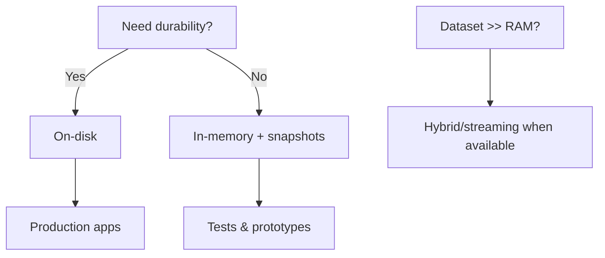

# Storage modes

**Audience:** developers choosing how ModelVault persists data.

ModelVault is an **embedded** database: you open it inside your process as either a **durable file** or an **in-memory** image. There is no separate server to configure. This page covers on-disk deployment (the default), in-memory testing, and the planned hybrid/streaming mode for very large queries.

Background: [Why ModelVault](why_modelvault.md) · [vs JSON files](../comparisons/json.md)

## Current status (1.0)

| Mode | Status |
|------|--------|
| **On-disk** | ✅ Open/create, superblocks, checksummed segments, schema catalog, indexes, typed queries, transactions |
| **In-memory** | ✅ Same APIs (`open_in_memory` / `Database::open_in_memory`) + snapshot export/import |
| **Hybrid / streaming** | 🔜 Roadmap — buffer pool + bounded-memory query operators |

Engine layout: [Rust crate layout](../specs/rust_crate_layout.md) · Plans: [ROADMAP](https://github.com/eddiethedean/modelvault/blob/main/ROADMAP.md)

## On-disk (default)

**One `.modelvault` file** — durable embedded persistence, “ship a file with your app.”

```python
db = modelvault.Database.open("app.modelvault")
```

```rust
let db = Database::open("app.modelvault")?;
```

Format details: [On-disk file format](../specs/on_disk_file_format.md).

!!! tip "When to choose this"
    Any production app that needs durability without a separate database server.

## In-memory (fast, explicit snapshot)

Same logical API; state lives in RAM.

| Property | Behavior |
|----------|----------|
| Durability | None implicit — snapshot when you choose |
| Speed | No steady-state I/O latency |
| Use cases | Tests, prototypes, ephemeral UI state |

```python
db = modelvault.Database.open_in_memory()
data = db.snapshot_bytes()          # save
db2 = modelvault.Database.open_snapshot_bytes(data)  # restore
```

```rust
let db = Database::open_in_memory()?;
```

## Hybrid & streaming (planned)

For datasets larger than RAM while staying embedded.

### Hybrid buffered (pager / buffer pool)

- Database remains a normal on-disk `.modelvault` file
- Internal buffer pool loads pages/segments on demand
- Dirty data written back to the same file

SQLite-style: hot working set in RAM, durable backing storage.

### Streaming query execution

Pull-based operators for scans/filters/limits; bounded-memory aggregations and joins (spillable strategies).

### Spill location (planned default)

Internal temporary segments **inside the same `.modelvault` file** — preserves the single-file mental model.

## Decision guide



| Need | Mode |
|------|------|
| Durability | **On-disk** |
| Speed + explicit save points | **In-memory + snapshots** |
| Beyond-RAM workloads | **Hybrid** (when shipped) |
